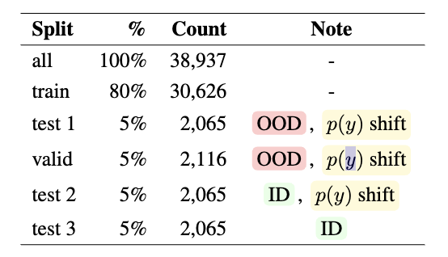
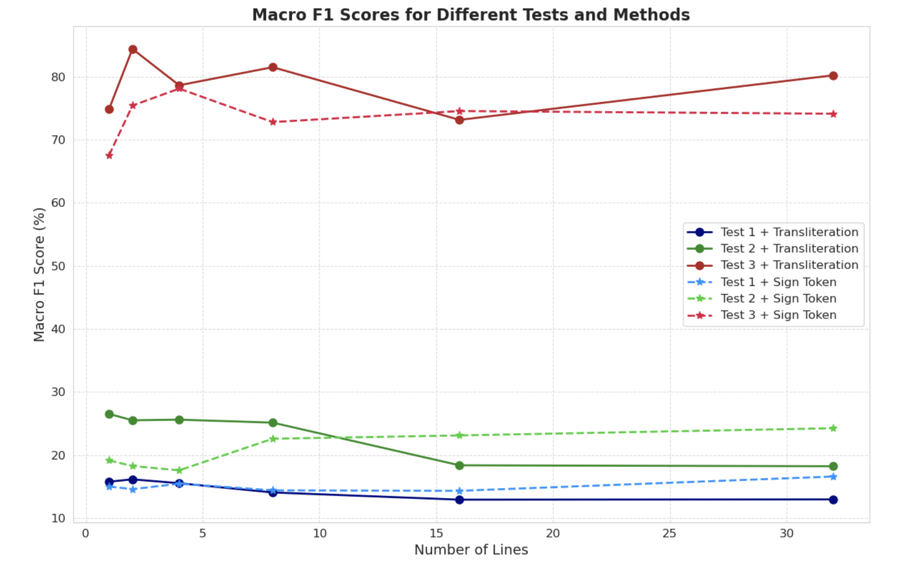

# README

## Overview

This is the code respository for our paper `Classification of Paleographic Artifacts at Scale: Mitigating Confounds and Distribution Shift in Cuneiform Tablet Dating`, accepted as an oral paper at Machine Learning for Ancient Language workshop (ml4al) 2024.

## Data split



We make three test sets as described in the paper.

## Repoducing results

To run:

```
python models/lstm_tests.py --batch_size 128 --text_field raw --dropout 0.1 --epochs 200 --data_path /graft3/code/tracy/data/final_may24_ver2 --lr 5e-4 --line 1 --wd 1e-3
```

## Data Analysis

For example:

```
python draw/scatter.py
```



## Correlation Alignment for Deep Domain Adaptation (CORAL) and Invariant Risk Minimization (IRM)

Please refer to raw_major-face_image.

## Citation

